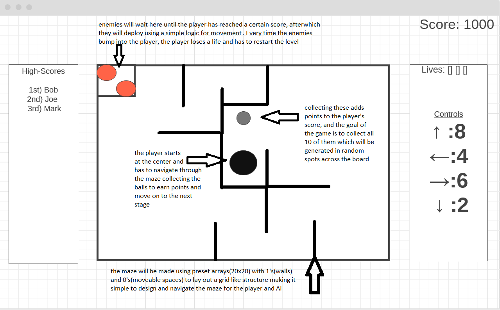

# Arcade Game
## Description
This is a game for which the goal is for the player to try and capture as many "Point Pellets" as they can before the enemies stop them.
## Wireframe

## Psudo Code
* make the const array to lay out the grid and then fill it with 1's and 0's to design the basic layout
* make another set of arrays which copy the first. This will be used as a guide by the point balls to help randomize their starting positions
* make all the other essential variables like high-score, lifes, and x,y grid-positions for the player and enemies
* layout the grid on screen to test how it works. 1 fills one block with black background color and 0 leaves the background color white
* design the player's movement to check the player's current position and only move to the user's desired direction if that block is marked with the number 0
* design the point balls to generate on random 0's and detect whether the user has come in contact with them
* design the score system and set it to increase by 10 for each point ball that is picked up by the player. every 100 points will grant the player another life
* let the enemies travel around the grid using only 0s by checking their surrounding every time they move and choose their movement direction based on that and a random number
* check during every move if the enemies have collided with the player and if they have, remove 1 life from the player and set the player to lose should their remaining lives reach negative
* setup the winning and losing/dying animations
* setup the start button and add animations for the characters and point balls
* set up a reset function to reset everything once the player runs out of lives or wants to start over
  
  ## Credits
  http://soundbible.com/ - Their great sound effects were used